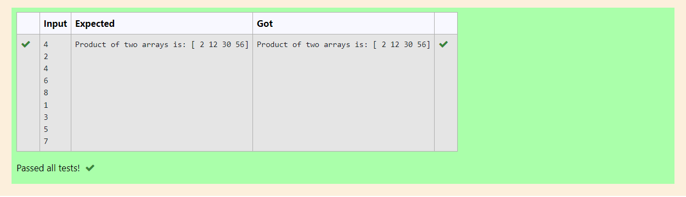

# Multiplying-two-matrix

## AIM:

## ALGORITHM:

### Step 1:
import numpy as np
### Step 2:
give the inputs
### Step 3:
use the for loop and range function
### Step 4:
multiply the two matrices
### Step 5:
check and verify the program

## PROGRAM: 
~~~
import numpy as np
n=int(input())
11,12=[],[]
for i in range (n):
    11.append(int(input()))
for i in range (n):
    12.append(int(input()))
value1 = np.append(11)
value2 = np.append(12)
result =  value1*value2
print("Product of two arrays is:",result)
~~~
## OUTPUT:

## RESULT:
Thus the program is written to multiply two matrices using python programming
